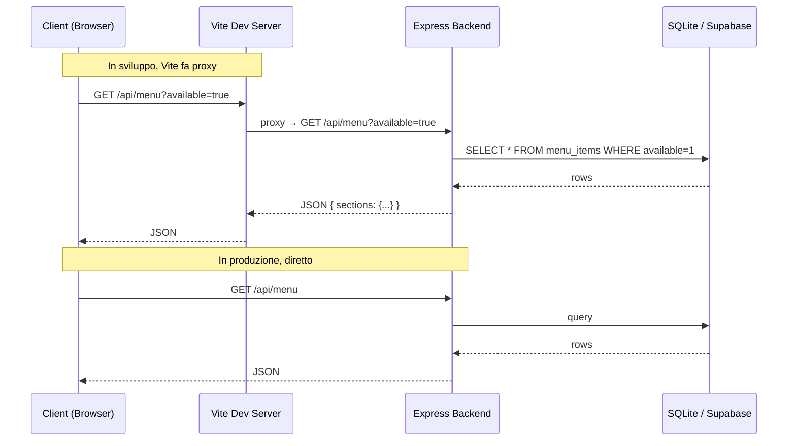
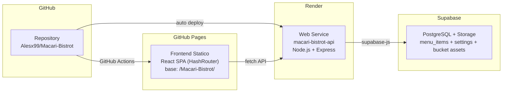

# Macàri Bistrot — Documentazione Tecnica Completa

> Documento di riferimento per replicare il progetto su un altro locale, integrando una landing page e mantenendo la parte gestionale.

---

## 1. Panoramica del Progetto

Applicazione **monorepo** per la gestione e visualizzazione di un menù digitale per un ristorante/bistrot. Opera in due modalità:

| Modalità | Descrizione |
|----------|-------------|
| **Locale (LAN/USB)** | Il server gira sul PC del locale; clienti e camerieri accedono via Wi-Fi. Il DB è SQLite locale. Zero dipendenze esterne. |
| **Online (Cloud)** | Backend su Render, DB su Supabase (PostgreSQL), frontend su GitHub Pages. |

### Funzionalità principali

- **Vista pubblica** (`/`) — Menù responsive con filtri per categoria, sfondo personalizzabile
- **Menù evento** (`/eventi`) — Variante del menù con layout dedicato per eventi speciali
- **Admin** (`/admin`) — CRUD piatti con drag-and-drop, editor di stile completo, gestione eventi (3 tab: Menù, Stile, Eventi)
- **QR Admin** (`/admin/qr`) — Generazione QR code per tavoli (range configurabile)
- **Stampa** (`/print`) — Anteprima A4 con puntatori di prezzo e filigrana, esportazione PDF
- **Stampa evento** (`/print-event`) — Stampa dedicata per menù evento
- **404** (`*`) — Pagina "non trovata" con link alla home

> **Due menù paralleli:** Il sistema gestisce un menù **regolare** e un menù **evento** come due insiemi indipendenti di piatti, distinti dal flag `is_event` nel database. Condividono le stesse API con un parametro flag.

---

## 2. Stack Tecnologico

### 2.1 Frontend

| Tecnologia | Versione | Scopo |
|------------|---------|-------|
| **React** | 18.3.x | UI library |
| **Vite** | 5.4.x | Build tool + dev server |
| **Tailwind CSS** | 3.4.x | Utility-first CSS framework |
| **react-router-dom** | 6.27.x | Routing SPA |
| **@dnd-kit** | core 6.1 + sortable 8.0 | Drag-and-drop per riordinare piatti |
| **react-to-print** | 3.0.x | Stampa dei componenti React |
| **qrcode** | 1.5.x | Generazione QR code in-browser |
| **@fontsource/playfair-display** | 5.1.x | Font titolo (locale, no CDN) |
| **@fontsource/montserrat** | 5.1.x | Font body (locale, no CDN) |
| **PostCSS + Autoprefixer** | 8.4 / 10.4 | Pipeline CSS |

> [!NOTE]
> Il frontend usa **HashRouter** (non BrowserRouter) per compatibilità con GitHub Pages. Gli URL hanno il formato `/#/admin`, `/#/print`, ecc.

### 2.2 Backend

| Tecnologia | Versione | Scopo |
|------------|---------|-------|
| **Node.js** | ≥ 24 LTS (locale) / 22 (Render) | Runtime |
| **Express** | 5.1.x | Web framework |
| **SQLite** (`node:sqlite`) | nativo Node 24 | Database locale (zero addon nativi) |
| **@supabase/supabase-js** | 2.49.x | Database cloud (PostgreSQL) |
| **Helmet** | 8.x | Sicurezza HTTP headers |
| **cors** | 2.8.x | Cross-Origin Resource Sharing |
| **express-rate-limit** | 7.4.x | Protezione brute-force |
| **Multer** | 2.0.x | Upload file multipart |
| **nanoid** | 5.0.x | Generazione nomi file unici |
| **morgan** | 1.10.x | Logging HTTP |
| **dotenv** | 16.4.x | Variabili d'ambiente |
| **nodemon** | 3.1.x | Hot-reload in sviluppo |

### 2.3 Infrastruttura / Deploy

| Strumento | Scopo |
|-----------|-------|
| **Render** | Hosting backend cloud (web service) |
| **GitHub Pages** | Hosting frontend statico (base path: `/Macari-Bistrot/`) |
| **Supabase** | Database PostgreSQL + Storage per asset (bucket `assets`) |
| **Inno Setup** | Generazione installer `.exe` per Windows |
| **GitHub Actions** | CI/CD — workflow `deploy-frontend.yml` (push su `main` → build → deploy Pages) |

---

## 3. Struttura del Progetto (Albero Completo)

```
Macàri Bistrot/
│
├── package.json                    # Script "tutto in uno" (root monorepo)
├── render.yaml                     # Blueprint deploy su Render
├── README.md                       # Documentazione utente
├── INSTALLER_WINDOWS.md            # Guida generazione installer .exe
├── SETUP_NUOVO_PC.md               # Guida setup su nuovo PC
├── avvio-rapido.bat                # Script batch: avvio + firewall + QR
├── package-win.bat                 # Script batch: build installer Windows
├── .gitignore                      # Esclusioni: node_modules, .env, uploads/*, data/*.db, dist/
│
├── backend/
│   ├── package.json                # Dipendenze backend
│   ├── .env                        # Configurazione (porta, password, Supabase)
│   ├── .env.example                # Template configurazione
│   ├── supabase-schema.sql         # Schema DDL per PostgreSQL (Supabase)
│   ├── data/
│   │   └── macari.db               # Database SQLite (generato al primo avvio)
│   ├── uploads/                    # Asset caricati (logo, sfondi, filigrane)
│   └── src/
│       ├── server.js               # Entry point Express
│       ├── db/
│       │   ├── index.js            # Accesso dati: schema + query (SQLite)
│       │   ├── supabase.js         # Accesso dati: query (Supabase/cloud)
│       │   └── seed.js             # Piatti di esempio
│       ├── middleware/
│       │   ├── auth.js             # Middleware autenticazione admin
│       │   └── validate.js         # Middleware validazione piatti
│       └── routes/
│           ├── auth.js             # POST /api/auth/login
│           ├── menu.js             # CRUD /api/menu
│           ├── settings.js         # GET/PUT /api/settings
│           └── upload.js           # POST/DELETE /api/upload
│
├── frontend/
│   ├── package.json                # Dipendenze frontend
│   ├── index.html                  # Entry point HTML
│   ├── vite.config.js              # Configurazione Vite (proxy, alias)
│   ├── tailwind.config.js          # Configurazione Tailwind CSS
│   ├── postcss.config.js           # Pipeline PostCSS
│   ├── public/                     # Asset statici (favicon, ecc.)
│   ├── dist/                       # Build di produzione (generata)
│   └── src/
│       ├── main.jsx                # Entry point React + BrowserRouter
│       ├── App.jsx                 # Routing principale (tutte le rotte)
│       ├── api/
│       │   └── client.js           # Client HTTP (fetch wrapper)
│       ├── hooks/
│       │   └── useMenu.js          # Hook React: caricamento menù + settings
│       ├── pages/
│       │   ├── PublicMenu.jsx      # Vista pubblica menù (/)
│       │   ├── PublicEventMenu.jsx # Vista pubblica menù evento (/event)
│       │   ├── Admin.jsx           # Pannello admin (/admin)
│       │   ├── AdminQr.jsx         # Generatore QR code (/admin/qr)
│       │   ├── PrintMenu.jsx       # Anteprima stampa menù (/print)
│       │   └── PrintEventMenu.jsx  # Anteprima stampa evento (/print/event)
│       ├── components/
│       │   ├── MenuManager.jsx     # Gestione piatti (lista + CRUD)
│       │   ├── DishForm.jsx        # Form creazione/modifica piatto
│       │   ├── SortableDish.jsx    # Riga piatto con drag-and-drop
│       │   ├── StyleEditor.jsx     # Editor stile (logo, sfondo, font, colori, stampa)
│       │   ├── PrintableMenu.jsx   # Componente menù stampabile
│       │   └── LoginForm.jsx       # Form di login admin
│       ├── fonts/                  # Font locali (@fontsource)
│       └── styles/
│           └── index.css           # Tailwind + regole @media print
│
├── scripts/
│   └── show-qr.js                  # Generazione QR code da terminale
│
├── installer/
│   └── windows/
│       ├── macari-setup.iss        # Script Inno Setup
│       └── output/                 # MacariBistrot-Setup.exe (generato)
│
├── MacariBistrot-Portatile/        # Versione portatile (USB)
│   ├── avvia.bat                   # Avvio da USB
│   ├── README.txt                  # Istruzioni versione portatile
│   └── app/                        # Copia del progetto per USB
│
└── .github/
    └── workflows/                  # CI/CD GitHub Actions
```

---

## 4. Backend — Architettura Dettagliata

### 4.1 Entry Point: [server.js](file:///c:/Users/betaland%20operatore/Documents/Progetto%20Mac%C3%A0ri%20Bistrot/backend/src/server.js)

Il file configura e avvia il server Express. Flusso:

1. **Carica `.env`** — `dotenv.config()` dal percorso relativo a `__dirname`
2. **Inizializza DB** — `initSchema()` crea le tabelle se non esistono (idempotente)
3. **Middleware globali** — Helmet (CSP disabilitata per dev), CORS, JSON parser (1MB limit), Morgan logging
4. **Rate limiter** — Solo su `/api/auth` (30 richieste / 5 min)
5. **Static files** — Serve `/uploads` con cache 7 giorni
6. **API routes** — Monta i 4 router sotto `/api/`
7. **SPA fallback** — Se `frontend/dist/` esiste, serve i file statici e fa fallback su `index.html` per tutte le rotte non-API
8. **Error handler** — Cattura errori globali, risponde JSON
9. **LAN IP** — Rileva e mostra l'IP LAN all'avvio per accesso dai dispositivi

```
Flusso richiesta:
  Client → Helmet → CORS → JSON Parser → Morgan
    → /api/auth     → rate limiter → authRouter
    → /api/menu     → menuRouter
    → /api/settings → settingsRouter
    → /api/upload   → uploadRouter
    → /* (non-api)  → SPA fallback (index.html)
```

### 4.2 Database Layer

#### 4.2.1 Modalità Locale — [db/index.js](file:///c:/Users/betaland%20operatore/Documents/Progetto%20Mac%C3%A0ri%20Bistrot/backend/src/db/index.js)

Usa il modulo nativo `node:sqlite` (Node 24+). **Nessun addon nativo da compilare**.

**Funzioni esportate:**

| Funzione | Firma | Descrizione |
|----------|-------|-------------|
| `initSchema()` | `() → void` | Crea tabelle `menu_items` e `settings` (idempotente con `IF NOT EXISTS`). Inserisce valori default nelle settings. |
| `getAllMenuItems(onlyAvailable, isEvent)` | `(bool, bool) → Object` | Ritorna piatti filtrabili per disponibilità e tipo (regolare/evento), ordinati per section→position→id |
| `getMenuItemById(id)` | `(id) → Object\|null` | Singolo piatto per ID |
| `createMenuItem(data)` | `({section, title, description, price, available, position, is_event}) → Object` | Inserisce un piatto, calcola `position` automaticamente se non fornita |
| `updateMenuItem(id, data)` | `(id, {...}) → Object\|null` | Aggiorna un piatto esistente, setta `updated_at` |
| `deleteMenuItem(id)` | `(id) → boolean` | Elimina un piatto |
| `reorderMenuItems(section, orderedIds, isEvent)` | `(string, number[], bool) → void` | Aggiorna le posizioni in una sezione (transazione SQLite / parallel Supabase) |
| `getAllSettings()` | `() → Object` | Legge tutte le impostazioni come `{key: value}` |
| `upsertSettings(entries)` | `([[key,value],...]) → Object` | Upsert impostazioni (`INSERT ON CONFLICT DO UPDATE`). Ritorna tutte le settings aggiornate |

**Schema SQLite:**

```sql
CREATE TABLE IF NOT EXISTS menu_items (
  id INTEGER PRIMARY KEY AUTOINCREMENT,
  section TEXT NOT NULL,
  title TEXT NOT NULL,
  description TEXT DEFAULT '',
  price REAL NOT NULL DEFAULT 0,
  available INTEGER NOT NULL DEFAULT 1,   -- booleano 0/1
  position INTEGER NOT NULL DEFAULT 0,
  is_event INTEGER NOT NULL DEFAULT 0,    -- 0 = menù regolare, 1 = menù evento
  created_at TEXT DEFAULT (datetime('now')),
  updated_at TEXT DEFAULT (datetime('now'))
);

CREATE INDEX idx_menu_section_position ON menu_items(section, position);

CREATE TABLE IF NOT EXISTS settings (
  key TEXT PRIMARY KEY,
  value TEXT
);
```

**Settings disponibili (con valori default):**

| Chiave | Default | Descrizione |
|--------|---------|-------------|
| `restaurant_name` | `"Macàri Bistrot"` | Nome del locale |
| `restaurant_subtitle` | `""` | Sottotitolo |
| `logo_path` | `""` | Path del logo (relativo a `/uploads`) |
| `background_path` | `""` | Path sfondo menù pubblico |
| `watermark_path` | `""` | Path filigrana per stampa |
| `font_title` | `"Playfair Display"` | Font titoli |
| `font_body` | `"Montserrat"` | Font corpo |
| `print_margin_mm` | `"15"` | Margine stampa in mm |
| `print_font_size_pt` | `"11"` | Dimensione font in stampa |
| `print_section_title_center` | `"false"` | Centra i titoli delle sezioni in stampa |
| `print_section_title_font` | `""` | Font titoli sezione in stampa |
| `print_section_title_size_em` | `"1.4"` | Dimensione titoli sezione (em) |
| `print_body_font` | `""` | Font corpo in stampa |
| `print_body_size_em` | `"1"` | Dimensione corpo in stampa (em) |
| `print_subtitle_font` | `""` | Font sottotitolo in stampa |
| `print_subtitle_size_em` | `"1"` | Dimensione sottotitolo (em) |
| `print_frame_enabled` | `"false"` | Abilita cornice decorativa |
| `print_frame_style` | `"classic"` | Stile cornice (classic/double/ornate/minimal_gold/vintage_menu) |
| `print_frame_color` | `"#8B6F3E"` | Colore cornice |
| `print_frame_thickness` | `"2"` | Spessore cornice (px) |
| `print_item_spacing_em` | `"0.3"` | Spaziatura tra piatti (em) |
| `print_section_spacing_em` | `"1"` | Spaziatura tra sezioni (em) |
| `print_auto_distribute` | `"false"` | Distribuisci automaticamente il contenuto sulla pagina |
| `print_paper_color` | `"#FFFFFF"` | Colore carta per stampa |
| `print_paper_opacity` | `"1"` | Opacità colore carta |
| `print_paper_intensity` | `"1"` | Intensità colore carta |
| `accent_color` | `"#8B4513"` | Colore accent (stile UI) |
| `currency_symbol` | `"€"` | Simbolo valuta |
| `section_order` | `""` | Ordine sezioni (stringa JSON) |
| `public_base_url` | `""` | URL base pubblico (per QR code) |
| `background_position` | `"center"` | Posizione sfondo CSS |
| `background_size` | `"cover"` | Dimensione sfondo CSS |
| `background_opacity` | `"0.3"` | Opacità sfondo |
| `background_pattern_type` | `"none"` | Tipo di pattern sfondo |
| `background_pattern_color` | `"#8B4513"` | Colore del pattern sfondo |
| `background_pattern_opacity` | `"0.1"` | Opacità del pattern |
| `background_pattern_size` | `"40"` | Dimensione del pattern |
| `watermark_pattern` | `"none"` | Pattern filigrana stampa (none/lines/diagonal/grid/dots/waves/cross) |
| `watermark_pattern_size` | `"40"` | Dimensione pattern filigrana |
| `watermark_pattern_color` | `"#8B4513"` | Colore pattern filigrana |
| `watermark_pattern_opacity` | `"0.08"` | Opacità pattern filigrana |
| `watermark_pattern_thickness` | `"1"` | Spessore tratto pattern |
| `watermark_pattern_frequency` | `"5"` | Frequenza pattern (1-10, 10=più denso) |
| `watermark_pattern_density` | `"3"` | Densità elementi pattern |
| `event_name` | `""` | Nome dell'evento speciale |
| `event_subtitle` | `""` | Sottotitolo evento |

> [!NOTE]
> Alla prima apertura del DB, `initSchema()` inserisce tutti i default con `INSERT OR IGNORE`. Il DB viene anche backuppato automaticamente in `data/backups/` (max 5 copie con rotazione).

#### 4.2.2 Modalità Cloud — [db/supabase.js](file:///c:/Users/betaland%20operatore/Documents/Progetto%20Mac%C3%A0ri%20Bistrot/backend/src/db/supabase.js)

Implementa le **stesse funzioni** di `index.js` ma usa `@supabase/supabase-js` per comunicare con un database PostgreSQL su Supabase. La selezione avviene in `index.js`: se `process.env.SUPABASE_URL` è definito, importa dinamicamente `supabase.js` e usa le sue funzioni.

**Funzioni aggiuntive (solo Supabase):**
- `uploadFile(bucket, filePath, buffer, contentType)` — upload a Supabase Storage
- `deleteFile(bucket, filePath)` — elimina da Storage
- `getPublicUrl(bucket, filePath)` — ritorna l'URL pubblico

**Schema Supabase (PostgreSQL):** → [supabase-schema.sql](file:///c:/Users/betaland%20operatore/Documents/Progetto%20Mac%C3%A0ri%20Bistrot/backend/supabase-schema.sql)

```sql
CREATE TABLE menu_items (
  id SERIAL PRIMARY KEY,
  section TEXT NOT NULL,
  title TEXT NOT NULL,
  description TEXT DEFAULT '',
  price NUMERIC(8,2) NOT NULL DEFAULT 0,
  available BOOLEAN NOT NULL DEFAULT true,
  position INTEGER NOT NULL DEFAULT 0,
  is_event BOOLEAN NOT NULL DEFAULT false,
  created_at TIMESTAMPTZ DEFAULT NOW(),
  updated_at TIMESTAMPTZ DEFAULT NOW()
);

CREATE INDEX idx_menu_section_position ON menu_items(section, position);

CREATE TABLE settings (
  key TEXT PRIMARY KEY,
  value TEXT
);

-- RLS abilitata con policy permissive (allow-all) per accesso via anon key
-- Trigger per aggiornare updated_at automaticamente
CREATE OR REPLACE FUNCTION update_updated_at_column()
RETURNS TRIGGER AS $$ ... $$;

CREATE TRIGGER update_menu_items_updated_at
BEFORE UPDATE ON menu_items
FOR EACH ROW EXECUTE FUNCTION update_updated_at_column();
```

#### 4.2.3 Seed — [db/seed.js](file:///c:/Users/betaland%20operatore/Documents/Progetto%20Mac%C3%A0ri%20Bistrot/backend/src/db/seed.js)

Script standalone (`node src/db/seed.js`) che popola il DB con piatti di esempio. Esegue `initSchema()` e poi inserisce piatti organizzati per sezione.

### 4.3 Middleware

#### [middleware/auth.js](file:///c:/Users/betaland%20operatore/Documents/Progetto%20Mac%C3%A0ri%20Bistrot/backend/src/middleware/auth.js)

```javascript
// Esporta: requireAdmin (middleware Express)
// Verifica l'header "x-admin-password" contro process.env.ADMIN_PASSWORD
// Se mancante o errata → 401 JSON
```

#### [middleware/validate.js](file:///c:/Users/betaland%20operatore/Documents/Progetto%20Mac%C3%A0ri%20Bistrot/backend/src/middleware/validate.js)

```javascript
// Esporta: validateMenuItem (middleware Express)
// Regole:
//   - section: obbligatorio, stringa, 1-60 caratteri, trimmed
//   - title: obbligatorio, stringa, 1-120 caratteri, trimmed
//   - description: opzionale, stringa, max 500 caratteri, default ''
//   - price: obbligatorio, numero finito, 0 ≤ price ≤ 9999
//   - available: opzionale, boolean o 0/1, default 1
//   - position: opzionale, intero, default 0
//   - is_event: opzionale, boolean o 0/1, default 0
// Normalizza req.body e chiama next(), o ritorna 400 con details[]
```

### 4.4 Routes API

#### [routes/auth.js](file:///c:/Users/betaland%20operatore/Documents/Progetto%20Mac%C3%A0ri%20Bistrot/backend/src/routes/auth.js)

| Metodo | Endpoint | Auth | Body | Risposta |
|--------|----------|------|------|----------|
| `POST` | `/api/auth/login` | — | `{ password }` | `{ ok: true }` o `401` |

#### [routes/menu.js](file:///c:/Users/betaland%20operatore/Documents/Progetto%20Mac%C3%A0ri%20Bistrot/backend/src/routes/menu.js)

| Metodo | Endpoint | Auth | Descrizione |
|--------|----------|------|-------------|
| `GET` | `/api/menu` | — | Tutti i piatti raggruppati per sezione. Query params: `?available=true&is_event=true`. Ritorna `{items[], grouped{}, sections[]}` |
| `GET` | `/api/menu/:id` | — | Singolo piatto per ID |
| `POST` | `/api/menu` | ✓ | Crea un piatto (body validato da `validateMenuItem`) |
| `PUT` | `/api/menu/:id` | ✓ | Aggiorna un piatto |
| `DELETE` | `/api/menu/:id` | ✓ | Elimina un piatto |
| `POST` | `/api/menu/reorder` | ✓ | Body `{ section, orderedIds, is_event }` — riordina i piatti |

#### [routes/settings.js](file:///c:/Users/betaland%20operatore/Documents/Progetto%20Mac%C3%A0ri%20Bistrot/backend/src/routes/settings.js)

| Metodo | Endpoint | Auth | Descrizione |
|--------|----------|------|-------------|
| `GET` | `/api/settings` | — | Tutte le impostazioni |
| `PUT` | `/api/settings` | ✓ | Aggiornamento parziale (solo chiavi in whitelist) |

**Whitelist settings modificabili (35 chiavi):** `restaurant_name`, `restaurant_subtitle`, `logo_path`, `background_path`, `watermark_path`, `font_title`, `font_body`, `print_margin_mm`, `print_font_size_pt`, `print_section_title_center`, `print_section_title_font`, `print_section_title_size_em`, `print_body_font`, `print_body_size_em`, `print_subtitle_font`, `print_subtitle_size_em`, `print_frame_enabled`, `print_frame_style`, `print_frame_color`, `print_frame_thickness`, `accent_color`, `currency_symbol`, `section_order`, `watermark_pattern`, `watermark_pattern_size`, `watermark_pattern_color`, `watermark_pattern_opacity`, `watermark_pattern_thickness`, `watermark_pattern_frequency`, `watermark_pattern_density`, `print_paper_color`, `print_paper_opacity`, `print_paper_intensity`, `public_base_url`, `print_item_spacing_em`, `print_section_spacing_em`, `print_auto_distribute`.

> [!WARNING]
> `event_name` e `event_subtitle` **non sono** nella whitelist di `settings.js`, anche se esistono come default nel DB. Per renderli modificabili via API, vanno aggiunti manualmente al Set `ALLOWED_KEYS`.

#### [routes/upload.js](file:///c:/Users/betaland%20operatore/Documents/Progetto%20Mac%C3%A0ri%20Bistrot/backend/src/routes/upload.js)

| Metodo | Endpoint | Auth | Descrizione |
|--------|----------|------|-------------|
| `POST` | `/api/upload/:kind` | ✓ | Upload file. `kind` = `logo` \| `background` \| `watermark`. Nome: `{kind}-{timestamp}-{nanoid(6)}.{ext}`. Online: upload a Supabase Storage (bucket `assets`). Locale: salva in `backend/uploads/`. |
| `DELETE` | `/api/upload/:filename` | ✓ | Elimina un file. Online: `deleteFile('assets', filename)`. Locale: `fs.unlinkSync()` con protezione path traversal (regex `/^[a-z0-9_\-.]+$/i`). |

**Sicurezza upload:**
- MIME type whitelist: `image/jpeg`, `image/png`, `image/webp`, `image/svg+xml`
- Estensione whitelist: `.jpg`, `.jpeg`, `.png`, `.webp`, `.svg`
- Limite dimensione: `MAX_UPLOAD_MB` (default 5 MB)
- Protezione path traversal sulla delete (blocca `..` nel filename)
- Il file viene rinominato `{kind}-{nanoid}.{ext}`

---

## 5. Frontend — Architettura Dettagliata

### 5.1 Entry Point e Routing

#### [main.jsx](file:///c:/Users/betaland%20operatore/Documents/Progetto%20Mac%C3%A0ri%20Bistrot/frontend/src/main.jsx)

Monta `<App />` dentro `<HashRouter>` (non BrowserRouter) su `#root` in `StrictMode`. Usa HashRouter per compatibilità con GitHub Pages (gli URL hanno `#` — es. `/#/admin`).

#### [App.jsx](file:///c:/Users/betaland%20operatore/Documents/Progetto%20Mac%C3%A0ri%20Bistrot/frontend/src/App.jsx)

Definisce tutte le rotte dell'applicazione:

```jsx
<Routes>
  <Route path="/"            element={<PublicMenu />} />
  <Route path="/eventi"      element={<PublicEventMenu />} />
  <Route path="/admin"       element={<Admin />} />
  <Route path="/admin/qr"    element={<AdminQr />} />
  <Route path="/print"       element={<PrintMenu />} />
  <Route path="/print-event" element={<PrintEventMenu />} />
  <Route path="*"            element={<404 page />} />
</Routes>
```

### 5.2 API Client — [client.js](file:///c:/Users/betaland%20operatore/Documents/Progetto%20Mac%C3%A0ri%20Bistrot/frontend/src/api/client.js)

Wrapper attorno a `fetch` che gestisce automaticamente la `BASE_URL` e l'header di autenticazione.

**Gestione password:** La password admin è salvata in `localStorage` con chiave `macari_admin_pwd` e allegata automaticamente come header `x-admin-password` su ogni richiesta.

**Funzioni di utilità esportate:**

| Funzione | Descrizione |
|----------|-------------|
| `setAdminPassword(pwd)` | Salva/rimuove password in localStorage |
| `getAdminPassword()` | Legge password da localStorage (o `''`) |
| `isAdminLogged()` | `true` se una password è salvata |

**Oggetto `api` esportato — metodi:**

| Metodo | Descrizione |
|--------|-------------|
| `api.login(password)` | POST `/api/auth/login`, salva password in localStorage |
| `api.logout()` | Rimuove password da localStorage |
| `api.getMenu(onlyAvailable, isEvent)` | GET `/api/menu` con query params opzionali |
| `api.createItem(item)` | POST `/api/menu` |
| `api.updateItem(id, item)` | PUT `/api/menu/:id` |
| `api.deleteItem(id)` | DELETE `/api/menu/:id` |
| `api.reorder(section, orderedIds, isEvent)` | POST `/api/menu/reorder` |
| `api.getSettings()` | GET `/api/settings` |
| `api.updateSettings(patch)` | PUT `/api/settings` |
| `api.uploadAsset(kind, file)` | POST `/api/upload/:kind` (FormData) |
| `api.deleteAsset(filename)` | DELETE `/api/upload/:filename` |

**BASE_URL:** Determinata da `import.meta.env.VITE_API_BASE_URL`. In sviluppo è vuoto (Vite proxy su `:4000`). Per GitHub Pages punta a `https://macari-bistrot-backend.onrender.com`.

### 5.3 Hook Personalizzato — [useMenu.js](file:///c:/Users/betaland%20operatore/Documents/Progetto%20Mac%C3%A0ri%20Bistrot/frontend/src/hooks/useMenu.js)

```javascript
// Hook: useMenu(onlyAvailable = true, isEvent = false)
// Ritorna: { menu, settings, loading, error, reload, setSettings }
//
// Al mount:
//   1. Chiama api.getMenu(onlyAvailable, isEvent) + api.getSettings() in parallelo (Promise.all)
//   2. menu = { items: [], grouped: {}, sections: [] }
//   3. settings = { key: value, ... }
//   4. reload() ricarica entrambi
//   5. Si ri-esegue quando onlyAvailable o isEvent cambiano
//
// Funzioni utility esportate dallo stesso file:
//   formatPrice(value, symbol) — formatta con virgola e simbolo (es. "12,50 €")
//   getOrderedSections(menuSections, settings) — ordina le sezioni secondo settings.section_order (JSON)
```

### 5.4 Pagine

#### [PublicMenu.jsx](file:///c:/Users/betaland%20operatore/Documents/Progetto%20Mac%C3%A0ri%20Bistrot/frontend/src/pages/PublicMenu.jsx) — Rotta `/`

Pagina pubblica del menù visibile ai clienti. Caratteristiche:
- Usa `useMenu(true)` per caricare solo piatti disponibili
- **Sfondo personalizzato** applicato dinamicamente dalle settings (immagine con `background-attachment: fixed`, posizione, opacità, gradient overlay)
- **Filtri per categoria** — barra sticky con pill-buttons (`CategoryChip`); "Tutto" mostra tutte le sezioni
- **Logo e titolo** dal database
- Sezioni ordinate tramite `getOrderedSections()`
- Ogni piatto: titolo con linea punteggiata verso il prezzo (stile menù classico), descrizione opzionale in corsivo
- Layout responsive (mobile-first)
- Footer: link ad "Area gestionale" (`/admin`) e "Versione stampabile" (`/print`)
- Stato vuoto: "Il menù è in aggiornamento"

#### [PublicEventMenu.jsx](file:///c:/Users/betaland%20operatore/Documents/Progetto%20Mac%C3%A0ri%20Bistrot/frontend/src/pages/PublicEventMenu.jsx) — Rotta `/eventi`

Variante del menù per eventi speciali:
- Usa `useMenu(true, true)` — solo piatti evento disponibili
- Badge "Evento Speciale" sopra il titolo
- Titolo = `settings.event_name`, sottotitolo = `settings.event_subtitle`
- Nome ristorante mostrato in piccolo sotto
- Link a "← Torna al Menù Classico" (`/`)

#### [Admin.jsx](file:///c:/Users/betaland%20operatore/Documents/Progetto%20Mac%C3%A0ri%20Bistrot/frontend/src/pages/Admin.jsx) — Rotta `/admin`

Pannello di amministrazione. Flusso:
1. Mostra `<LoginForm />` se non autenticato (`isAdminLogged()` = false)
2. Dopo il login, mostra **3 tab** con componenti wrapper dedicati:
   - **Menù** → `<MenuManagerWrapper />` — carica menù regolare, renderizza `<MenuManager />`
   - **Stile** → `<StyleEditorWrapper />` — carica settings, renderizza `<StyleEditor />`
   - **Eventi** → `<EventManagerWrapper />` — carica menù evento (`isEvent=true`), renderizza `<EventManagerPage />`
3. La password è in `localStorage` (gestita da `api/client.js`)
4. Header con link: "QR Tavoli" → `/admin/qr`, "Vedi pubblico" → `/`, "Stampa PDF" → `/print`, "Esci" → logout

**`EventManagerPage` (componente interno):**
- Campi editabili per `event_name` e `event_subtitle` (salvati via `api.updateSettings()`)
- Genera QR code per `/#/eventi` con libreria `qrcode`
- QR scaricabile come immagine
- Link a `/print-event` e apertura evento in nuovo tab
- Renderizza `<MenuManager isEvent={true} />` per gestire i piatti evento

#### [AdminQr.jsx](file:///c:/Users/betaland%20operatore/Documents/Progetto%20Mac%C3%A0ri%20Bistrot/frontend/src/pages/AdminQr.jsx) — Rotta `/admin/qr`

Generatore QR code per **numeri tavolo**:
- Configurabile: tavolo iniziale, tavolo finale (default 1–20), dimensione pixel QR (default 170), URL base
- URL generato per ogni tavolo: `{baseUrl}/?table={n}`
- URL base salvabile nel backend (`public_base_url` via `api.updateSettings()`)
- "Stampa foglio QR" → `window.print()` con classe `no-print` per nascondere i controlli
- Ogni card QR mostra: numero tavolo, istruzioni, immagine QR, URL testuale

#### [PrintMenu.jsx](file:///c:/Users/betaland%20operatore/Documents/Progetto%20Mac%C3%A0ri%20Bistrot/frontend/src/pages/PrintMenu.jsx) — Rotta `/print`

Pagina di anteprima per la stampa A4:
- Usa `useMenu(true)` e `<PrintableMenu />` con `react-to-print` (`useReactToPrint`)
- **Selettore sezioni:** Toggle per includere/escludere categorie dalla stampa
- **Preset rapidi:** "Seleziona Tutto", "Deseleziona Tutto", "Escludi Bevande" (keywords: vini, bevande, cocktails, drinks, birre, cantina, liquori, wine, beverages, bar), "Solo Drink List"
- **"Una sezione per pagina"** — checkbox che aggiunge page break tra le sezioni
- **Paper background** — funzione `getPaperBackground(hex, opacity, intensity)` converte HEX→HSLA
- Container anteprima A4 con dimensioni esatte (`210mm × 297mm`) e margini configurabili
- Stili `@page` iniettati via prop `pageStyle` di `useReactToPrint`

#### [PrintEventMenu.jsx](file:///c:/Users/betaland%20operatore/Documents/Progetto%20Mac%C3%A0ri%20Bistrot/frontend/src/pages/PrintEventMenu.jsx) — Rotta `/print-event`

Come `PrintMenu` ma per il layout evento:
- `useMenu(true, true)` — piatti evento disponibili
- Passa `isEvent={true}` a `<PrintableMenu />`
- Nessun filtro bevande (solo "Seleziona/Deseleziona Tutto")
- Titolo = nome evento da settings
- Link "Torna all'Admin" invece di "Torna al menù"
- Contiene duplicato della funzione `getPaperBackground()`

### 5.5 Componenti

#### [LoginForm.jsx](file:///c:/Users/betaland%20operatore/Documents/Progetto%20Mac%C3%A0ri%20Bistrot/frontend/src/components/LoginForm.jsx)

```jsx
// Props: { onLogin(password) }
// Form con campo password + submit
// Chiama login() dall'API client, se ok chiama onLogin(password)
```

#### [MenuManager.jsx](file:///c:/Users/betaland%20operatore/Documents/Progetto%20Mac%C3%A0ri%20Bistrot/frontend/src/components/MenuManager.jsx)

Componente principale per la gestione dei piatti. Include:
- **Lista piatti** raggruppata per sezione
- **Drag-and-drop** con `@dnd-kit/core` + `@dnd-kit/sortable` per riordinare all'interno di una sezione
- **CRUD** — Crea, modifica, elimina piatti (con conferma su delete)
- **Toggle disponibilità** — On/off per ogni piatto
- **Filtro sezione** — Dropdown per visualizzare una sezione alla volta
- **Gestione ordine sezioni** — UI per spostare sezioni su/giù; salva `section_order` come JSON via `api.updateSettings()`
- Sezioni default per nuovi piatti: `['Antipasti', 'Primi', 'Secondi', 'Contorni', 'Dolci', 'Vini', 'Bevande']` mergiate con quelle esistenti
- Usa `<DishForm />` per la creazione/modifica
- Usa `<SortableDish />` per le righe draggabili (dentro componente interno `<SectionBlock />`)

```jsx
// Props: { menu, settings, onChanged, isEvent }
// Funzioni: handleSave (create/update), handleDelete (con confirm), toggleAvailable
// Quando isEvent=true, tutte le operazioni CRUD includono is_event: true
```

#### [DishForm.jsx](file:///c:/Users/betaland%20operatore/Documents/Progetto%20Mac%C3%A0ri%20Bistrot/frontend/src/components/DishForm.jsx)

```jsx
// Props: { initial, sections, onCancel, onSubmit }
// Form controllato con campi:
//   - title (text)
//   - section (text con datalist per autocomplete da sezioni esistenti)
//   - description (textarea, max 500)
//   - price (number, step 0.10)
//   - available (checkbox)
// Default: { section: 'Antipasti', title: '', description: '', price: 0, available: true, position: 0 }
// Modal: overlay full-screen (fixed inset-0 bg-black/40), click backdrop = onCancel
// Mostra "Modifica piatto" o "Nuovo piatto" in base a initial prop
```

#### [SortableDish.jsx](file:///c:/Users/betaland%20operatore/Documents/Progetto%20Mac%C3%A0ri%20Bistrot/frontend/src/components/SortableDish.jsx)

```jsx
// Props: { item, onEdit, onDelete, onToggle, disabled }
// Usa useSortable(item.id) da @dnd-kit/sortable
// Handle drag: ☰ con cursor-grab
// Mostra: titolo, descrizione troncata, prezzo (formatPrice), badge "Non disponibile" in ambra
// Piatti non disponibili: opacity-70
// Azioni: 👁/🚫 toggle, "Modifica", "Elimina" (danger style)
```

#### [StyleEditor.jsx](file:///c:/Users/betaland%20operatore/Documents/Progetto%20Mac%C3%A0ri%20Bistrot/frontend/src/components/StyleEditor.jsx)

Il componente più complesso (~22KB). Editor visuale per tutte le impostazioni di stile:

| Sezione | Controlli |
|---------|-----------|
| **Identità** | Nome locale, sottotitolo, upload logo |
| **Sfondo** | Upload immagine, posizione (center/top/bottom), dimensione (cover/contain/auto), opacità (slider 0-1) |
| **Pattern** | Tipo (none/dots/lines/grid/diamonds), colore, opacità, dimensione |
| **Tipografia** | Font titolo (Playfair Display, ecc.), font body (Montserrat, ecc.) |
| **Colori** | Colore accent (color picker) |
| **Valuta** | Simbolo (€, $, £, ecc.) |
| **Stampa** | Margini (mm), dimensione font (pt), upload filigrana |

```jsx
// Props: { password }
// State: settings (tutte le impostazioni), previews (anteprima upload)
// Ogni modifica chiama updateSettings() tramite API
// Gli upload chiamano uploadImage() e aggiornano il path nelle settings
```

#### [PrintableMenu.jsx](file:///c:/Users/betaland%20operatore/Documents/Progetto%20Mac%C3%A0ri%20Bistrot/frontend/src/components/PrintableMenu.jsx)

Componente che renderizza il menù in formato stampabile A4 (~340 righe). Usa `React.forwardRef` per compatibilità con `react-to-print`.

```jsx
// Props: { menu, settings, selectedSections, sectionPerPage, isEvent }
```

Caratteristiche:
- **Tipografia configurabile** — Font e dimensioni (em) per sezione titolo, corpo, sottotitolo, tutti con `clampNumber()` per valori sicuri
- **Puntatori di prezzo** — `Pasta al forno ........... 10€` (flex layout con classe `.price-row` e dotted leader line)
- **Cornice decorativa** — 5 stili CSS (classic, double, ornate con fleurons ❦, minimal_gold, vintage_menu) renderizzati in `.print-frame`
- **Filigrana** — O immagine caricata (centrata, opacity 0.08) OPPURE pattern SVG geometrico generato inline
- **Generatore pattern SVG** — Funzione `getWatermarkPatternStyle(type, settings)` genera data URI SVG per: lines, diagonal, grid, dots, waves, cross. Configurabile: colore, opacità, spessore, frequenza (1-10 → 180-24px celle), densità
- **Paper background** — `getPaperBackground(hex, opacity, intensity)` converte HEX→HSL→HSLA
- **Layout** — Header (logo, nome, sottotitolo, divider accent) → sezioni → footer "Powered by Alesx99"
- **Auto-distribute** — `justify-content: space-between` per distribuire il contenuto verticalmente
- **CSS variables settate** — `--print-margin`, `--print-font-size`, `--print-paper-bg`
- **Break rules** — `break-inside: avoid` su piatti, `break-after: avoid` su titoli sezione
- Se `isEvent=true`, usa `event_name`/`event_subtitle` invece di `restaurant_name`

### 5.6 Stili — [index.css](file:///c:/Users/betaland%20operatore/Documents/Progetto%20Mac%C3%A0ri%20Bistrot/frontend/src/styles/index.css)

```css
/* Font locali (nessun CDN) */
@import '@fontsource/playfair-display' (400/600/700);
@import '@fontsource/montserrat' (300/400/500/600);

/* Tailwind layers */
@tailwind base;
@tailwind components;
@tailwind utilities;

/* @layer base — html/body/root full-height, font defaults */
/* @layer components — .btn, .btn-primary, .btn-secondary, .btn-danger, .input, .label, .card */

/* Regole @media print (~150 righe) */
@media print {
  @page { size: A4; margin: var(--print-margin); }
  /* Nasconde tutto tranne .print-area (approccio visibility con :has) */
  .no-print { display: none !important; }
  .print-section { break-inside: avoid; }
  .print-item { break-inside: avoid; page-break-inside: avoid; }
  .print-section h2 { break-after: avoid; }
  .print-section--page-break { page-break-before: always; } /* eccetto :first-child */
  .print-watermark { position: fixed; full-bleed; z-behind; }
  .print-content { position: relative; min-height: calc(A4 - margins); flex column; }
  .print-content--distribute { justify-content: space-between; }
  .print-frame { position: fixed; 5 style variants (classic/double/ornate/minimal_gold/vintage_menu) }
}

/* Screen-only print preview (.print-page) — duplica stili print con position: absolute */
/* .price-row — flex per nome piatto...prezzo con dotted leader */
```

### 5.7 Configurazione Build

#### [vite.config.js](file:///c:/Users/betaland%20operatore/Documents/Progetto%20Mac%C3%A0ri%20Bistrot/frontend/vite.config.js)

```javascript
export default defineConfig({
  plugins: [react()],
  base: process.env.GITHUB_PAGES === 'true' ? '/Macari-Bistrot/' : '/',
  server: {
    host: '0.0.0.0',
    port: 5173,
    proxy: {
      '/api': 'http://localhost:4000',     // Proxy API al backend in dev
      '/uploads': 'http://localhost:4000'   // Proxy uploads al backend in dev
    }
  },
  build: { outDir: 'dist', sourcemap: false }
});
```

> [!NOTE]
> Quando il workflow GitHub Actions builda il frontend, setta `GITHUB_PAGES=true` e `VITE_API_BASE_URL=https://macari-bistrot-backend.onrender.com`, così il frontend su Pages comunica col backend su Render.

#### [tailwind.config.js](file:///c:/Users/betaland%20operatore/Documents/Progetto%20Mac%C3%A0ri%20Bistrot/frontend/tailwind.config.js)

```javascript
export default {
  content: ['./index.html', './src/**/*.{js,jsx,ts,tsx}'],
  theme: {
    extend: {
      colors: {
        bistrot: {
          50:  '#FAF6EF',  // crema chiaro
          100: '#F0E6D0',
          // ... scala progressiva
          600: '#8B6F3E',  // accent primario (theme-color)
          900: '#3D2E15'   // testo scuro
        }
      },
      fontFamily: {
        display: ['"Playfair Display"', 'Georgia', 'serif'],
        sans: ['Montserrat', 'system-ui', 'sans-serif']
      }
    }
  }
};
```

---

## 6. Flusso Dati (Frontend ↔ Backend)



---

## 7. Variabili d'Ambiente

### [backend/.env](file:///c:/Users/betaland%20operatore/Documents/Progetto%20Mac%C3%A0ri%20Bistrot/backend/.env.example)

| Variabile | Default | Descrizione |
|-----------|---------|-------------|
| `PORT` | `4000` | Porta del server |
| `HOST` | `0.0.0.0` | Indirizzo di binding |
| `NODE_ENV` | `development` | Ambiente (`development` / `production`) |
| `ADMIN_PASSWORD` | `macari2024` | Password per le operazioni admin |
| `MAX_UPLOAD_MB` | `5` | Limite dimensione upload in MB |
| `SUPABASE_URL` | *(vuoto)* | URL progetto Supabase (attiva modalità cloud) |
| `SUPABASE_KEY` | *(vuoto)* | API key Supabase |
| `CORS_ORIGIN` | `*` | Origini CORS permesse (separati da virgola) |

> [!IMPORTANT]
> Se `SUPABASE_URL` e `SUPABASE_KEY` sono definiti, il backend usa **Supabase (PostgreSQL)** invece di SQLite. Altrimenti funziona in modalità locale con SQLite.

---

## 8. Script e Automazioni

### 8.1 Script npm (root [package.json](file:///c:/Users/betaland%20operatore/Documents/Progetto%20Mac%C3%A0ri%20Bistrot/package.json))

| Comando | Azione |
|---------|--------|
| `npm run install:all` | Installa dipendenze backend + frontend + qrcode-terminal |
| `npm run seed` | Popola DB con piatti di esempio |
| `npm run dev:backend` | Avvia backend con nodemon (porta 4000) |
| `npm run dev:frontend` | Avvia Vite dev server (porta 5173) |
| `npm run build` | Build di produzione del frontend (`frontend/dist/`) |
| `npm start` | Avvia solo backend (serve anche `dist/` se presente) |
| `npm run qr` | Mostra QR code nel terminale |
| `npm run package:win` | Genera installer Windows `.exe` |

### 8.2 [avvio-rapido.bat](file:///c:/Users/betaland%20operatore/Documents/Progetto%20Mac%C3%A0ri%20Bistrot/avvio-rapido.bat)

Script batch Windows che:
1. Controlla se Node.js è installato
2. Apre la porta nel firewall di Windows (richiede admin)
3. Installa le dipendenze se necessario
4. Esegue il build del frontend
5. Avvia il server backend
6. Mostra il QR code per l'accesso

### 8.3 [scripts/show-qr.js](file:///c:/Users/betaland%20operatore/Documents/Progetto%20Mac%C3%A0ri%20Bistrot/scripts/show-qr.js)

Script Node.js che:
1. Rileva l'IPv4 LAN della macchina
2. Compone l'URL (es. `http://192.168.1.50:4000`)
3. Genera e stampa il QR code nel terminale
4. Accetta opzioni `--port` e `--path`

### 8.4 Versione Portatile (USB)

La directory `MacariBistrot-Portatile/` contiene una versione auto-contenuta per USB:
- `avvia.bat` — Script di avvio dalla chiavetta
- `app/` — Copia completa del progetto
- Pensata per essere usata su PC senza installazione

### 8.5 Installer Windows

Usa **Inno Setup** per generare un `.exe` installabile:
- Script: `installer/windows/macari-setup.iss`
- Output: `installer/windows/output/MacariBistrot-Setup.exe`
- Include Node.js embedded, backend, frontend pre-buildato
- Crea collegamenti sul desktop e nel menu Start

---

## 9. Deploy Cloud (Architettura)

### 4 Canali di Distribuzione

| Canale | Entry Point | Target | Node richiesto? |
|--------|-------------|--------|------------------|
| **Sviluppo** | `avvio-rapido.bat` | PC sviluppatore/bistrot | Sì (Node 24) |
| **USB Portatile** | `MacariBistrot-Portatile/avvio-portatile.bat` | Qualsiasi PC Windows via USB | No (node.exe embedded ~99MB) |
| **Installer Windows** | `installer/windows/output/MacariBistrot-Setup.exe` | PC target (installazione permanente) | Sì (Node 24, verificato dall'installer) |
| **Cloud/Demo** | GitHub Actions → GitHub Pages + Render | Browser web | N/A (hosted) |



### Configurazione Render — [render.yaml](file:///c:/Users/betaland%20operatore/Documents/Progetto%20Mac%C3%A0ri%20Bistrot/render.yaml)

```yaml
services:
  - type: web
    name: macari-bistrot-api
    runtime: node
    plan: free
    rootDir: backend
    buildCommand: npm install
    startCommand: node src/server.js
    envVars:
      - key: NODE_VERSION     → "22"
      - key: SUPABASE_URL     → (dashboard)
      - key: SUPABASE_KEY     → (dashboard)
      - key: ADMIN_PASSWORD   → (dashboard)
      - key: CORS_ORIGIN      → "https://alesx99.github.io"
      - key: NODE_ENV          → "production"
```

---

## 10. Sicurezza

| Misura | Implementazione |
|--------|-----------------|
| **HTTP headers** | `helmet` con CSP disabilitata solo in dev |
| **Rate limiting** | 30 req / 5 min su `/api/auth` |
| **Autenticazione** | Header `x-admin-password` su tutte le rotte di scrittura |
| **Settings whitelist** | Solo chiavi note modificabili |
| **Upload sicuri** | MIME whitelist, estensione whitelist, limite dimensione, path traversal protection |
| **CORS** | Configurabile via `.env` (default: tutto aperto per LAN) |
| **Validazione input** | Middleware `validateDish` con regole stringenti |

> [!WARNING]
> L'app è progettata per **rete locale fidata**. Per esposizione su Internet, aggiungere HTTPS e un sistema di autenticazione più robusto (JWT, OAuth, ecc.).

---

## 11. Guida alla Replica per un Nuovo Locale

### 11.1 Cosa Cambiare (Minimo)

| File | Cosa modificare |
|------|-----------------|
| `backend/.env` | `ADMIN_PASSWORD` — cambiare la password |
| `backend/src/db/index.js` | I valori default di `restaurant_name` e `restaurant_subtitle` |
| `backend/src/db/seed.js` | Sostituire i piatti di esempio con quelli del nuovo locale |
| `frontend/index.html` | Il `<title>` della pagina |
| `package.json` (root) | `name` e `description` |
| `render.yaml` | `name` del servizio, `CORS_ORIGIN` |

### 11.2 Cosa si può Riutilizzare al 100%

- ✅ Tutta la struttura backend (server, routes, middleware, DB layer)
- ✅ Tutte le API (stessa interfaccia)
- ✅ Il sistema di upload
- ✅ Il pannello admin e lo style editor
- ✅ Il sistema di stampa
- ✅ Il dual-mode SQLite/Supabase
- ✅ Gli script di automazione (con path aggiornati)
- ✅ L'installer Windows (con branding aggiornato)

### 11.3 Dove Inserire la Landing Page

La struttura attuale ha la rotta `/` che punta direttamente al menù. Per aggiungere una landing page:

```
Rotte attuali (con HashRouter):     Rotte con landing:
/#/           → PublicMenu          /#/           → LandingPage (NUOVA)
/#/eventi     → EventMenu           /#/menu       → PublicMenu (spostato)
/#/admin      → Admin               /#/eventi     → PublicEventMenu
/#/admin/qr   → AdminQr             /#/admin      → Admin
/#/print      → Print               /#/admin/qr   → AdminQr
/#/print-event → PrintEvent         /#/print      → PrintMenu
                                     /#/print-event → PrintEventMenu
```

**Modifiche necessarie:**

1. **Creare** `frontend/src/pages/LandingPage.jsx` — La nuova landing page (hero, about, gallery, contatti, CTA verso il menù)
2. **Modificare** `frontend/src/App.jsx` — Aggiungere rotta `/` → `<LandingPage />`, spostare menù su `/menu`
3. **Aggiornare** `frontend/src/api/client.js` — Nessuna modifica necessaria (le API restano le stesse)
4. **Aggiornare** i link interni:
   - `PublicMenu.jsx` footer: link admin e print (invariati)
   - `Admin.jsx` header: link "Vedi pubblico" da `/` a `/menu`
   - `AdminQr.jsx`: URL base per QR code tavoli
   - `PublicEventMenu.jsx`: link "← Torna al Menù Classico" da `/` a `/menu`

### 11.4 Architettura Target (con Landing)

```
NuovoLocale/
├── backend/          ← Identico, cambia solo .env e seed.js
├── frontend/
│   └── src/
│       ├── pages/
│       │   ├── LandingPage.jsx     ← NUOVO: hero, about, gallery, contatti, CTA menù
│       │   ├── PublicMenu.jsx      ← Invariato (rotta cambia da / a /menu)
│       │   ├── PublicEventMenu.jsx ← Aggiornare link ritorno (/ → /menu)
│       │   ├── Admin.jsx           ← Aggiornare link "Vedi pubblico" (/ → /menu)
│       │   ├── AdminQr.jsx         ← Invariato
│       │   ├── PrintMenu.jsx       ← Invariato
│       │   ├── PrintEventMenu.jsx  ← Invariato
│       │   └── ...
│       └── App.jsx                 ← Aggiorna routing
├── scripts/          ← Invariato (aggiornare riferimenti al nome)
└── ...
```

---

## 12. Dipendenze Complete

### Backend (`backend/package.json`)

| Pacchetto | Versione | Tipo |
|-----------|---------|------|
| `@supabase/supabase-js` | ^2.49.4 | runtime |
| `cors` | ^2.8.5 | runtime |
| `dotenv` | ^16.4.5 | runtime |
| `express` | ^5.1.0 | runtime |
| `express-rate-limit` | ^7.4.0 | runtime |
| `helmet` | ^8.0.0 | runtime |
| `morgan` | ^1.10.0 | runtime |
| `multer` | ^2.0.2 | runtime |
| `nanoid` | ^5.0.7 | runtime |
| `nodemon` | ^3.1.7 | dev |

### Frontend (`frontend/package.json`)

| Pacchetto | Versione | Tipo |
|-----------|---------|------|
| `@dnd-kit/core` | ^6.1.0 | runtime |
| `@dnd-kit/sortable` | ^8.0.0 | runtime |
| `@dnd-kit/utilities` | ^3.2.2 | runtime |
| `@fontsource/montserrat` | ^5.1.0 | runtime |
| `@fontsource/playfair-display` | ^5.1.0 | runtime |
| `react` | ^18.3.1 | runtime |
| `react-dom` | ^18.3.1 | runtime |
| `react-router-dom` | ^6.27.0 | runtime |
| `react-to-print` | ^3.0.2 | runtime |
| `qrcode` | ^1.5.4 | runtime |
| `@types/react` | ^18.3.10 | dev |
| `@types/react-dom` | ^18.3.0 | dev |
| `@vitejs/plugin-react` | ^4.3.1 | dev |
| `autoprefixer` | ^10.4.20 | dev |
| `postcss` | ^8.4.47 | dev |
| `tailwindcss` | ^3.4.13 | dev |
| `vite` | ^5.4.8 | dev |

---

## 13. Comandi Rapidi di Riferimento

```bash
# === SETUP INIZIALE ===
npm run install:all          # Installa tutto
npm run seed                 # Piatti di esempio nel DB

# === SVILUPPO ===
npm run dev:backend          # Terminale 1: backend su :4000
npm run dev:frontend         # Terminale 2: frontend su :5173

# === PRODUZIONE LOCALE ===
npm run build                # Build frontend
npm start                    # Server tutto-in-uno su :4000

# === UTILITÀ ===
npm run qr                   # QR code nel terminale
npm run package:win          # Genera installer .exe
```

---

> [!TIP]
> Per la replica: il progetto è progettato per essere **white-label**. Tutti i riferimenti al "Macàri Bistrot" sono nelle settings del database e nella seed. Cambiando quelli + la password admin, il nuovo locale è operativo.
